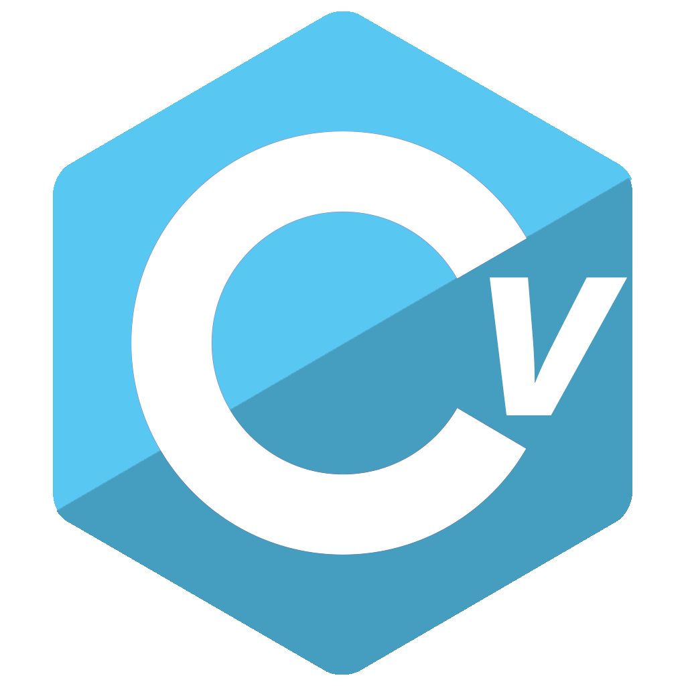

#  CV, Sevass

CV, pronounced "se-vass" is a C# dialect where everything is in Swedish.


## Installation

### Prerequisites

- The Roslyn compiler, which is included in the [.NET SDK](https://dotnet.microsoft.com/en-us/), added to PATH. You can
  run `csc` to verify that it is installed.
- [Visual Studio Code](https://code.visualstudio.com/) with the [Sevass language extension](https://marketplace.visualstudio.com/items?itemName=Salmon.sevassvsc) (optional)
- [Git](https://git-scm.com/) (optional)

1. Clone the repository

```sh
git clone https://github.com/LiterallyFabian/sevass.git
```

2. Build the project

```sh
cd sevass
dotnet build
```

3. Add the project to PATH (optional)

## Usage

| Command                                | Description |
|----------------------------------------|-------------|
| `sevass translate <path [cs\|cv]>` | Translates Sevass code into C# code, or vice versa. |
| `sevass build <path [cv]>`             | Compiles Sevass code into an executable. |
| `sevass run <path [cv]>`               | Compiles and runs Sevass code. |

## Subprojects

### [SevassRewriter.cs](Sevass/SevassRewriter.cs)

The Sevass rewriter class can translate Sevass code into C# and vice versa. To translate C# into Sevass it uses
the [Roslyn API](https://github.com/dotnet/roslyn) to tokenize C# code, and then translates the tokens into the Swedish
Sevass equivalent. To compile and/or run a Sevass program it will need to be translated into C# first, which is also
done by the Sevass rewriter.

### SevassVSC

SevassVSC is a language extension for Visual Studio Code based on the extension templates
by [Yeoman](https://yeoman.io/). It uses a modified version of the C# syntax grammar directly
from [dotnet/csharp-tmLanguage](https://github.com/dotnet/csharp-tmLanguage), licensed
under [MIT](https://github.com/dotnet/csharp-tmLanguage/blob/main/LICENSE).

SevassVSC is not needed to compile or run Sevass code, but it is recommended as it provides syntax highlighting and
other features.
